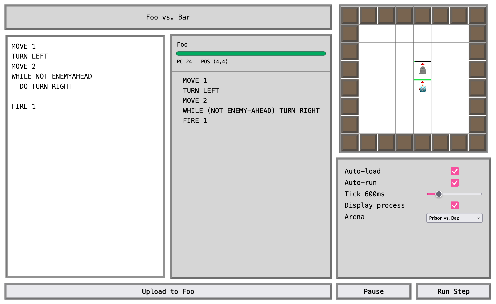

# Bot Arena, the little functional programming game

A pure functional bot arena game with Game Queue and ACTIONS.



This game is written in Elm, with three main parts:

1. **Parser**: Parses the bot scripts. The parsed commands are then stored in the bot's program queue.
2. **Interpreter**: The interpreter implements the bot instructions and updates the game state.
3. **View**: The view takes the game's state and renders it to the screen.

## Setup

You need git and Elm to run this project.

Optional: install Elm-Live as described in [www.elm-live.com](https://www.elm-live.com/).

```sh
# Clone this repo
git clone git@github.com:ap-fhnw/bot-arena.git
cd bot-arena

# Build and run
elm make src/Main.elm --output=main.js
elm-live src/Main.elm --open -- --output=main.js

# Or simply use elm reactor
elm reactor
```

## Gameplay

To interact with the bot, you need to type commands in the left input field. If all commands are valid you can see the parsed programm in the right field beside the input field. All commands are relative to the bots position and orientation.

- Click `Upload to Foo` to load the script to your bot.
- Click `Run` to execute the program.
- Click `Run Step` to execute one step of the program.

You can define the tick speed using the `Tick` slider. Moreover you are able to pause the game and resume it later by using the `Pause` / `Run` button.

You can also enable the options to automatically parse (auto-load) and run (auto-run) your script.

### Commands

|Command          |Effect|
|-----------------------|------|
|`MOVE n`               |Moves the bot ahead by n fields in the current direction. |
|`TURN dir`             |Turns the bot in the given direction: `RIGHT\|LEFT\|AROUND\|STRAIGHT`. |
|`FIRE`                 |Triggers the bot to fire in the direction it is looking|
|`REPEAT n instr`       |Repeats given `instr` `n`-times.|
|`WHILE cond DO instr`  |Executes `instr` as long as `cond` evaluates to `True`\*. |
|`IF cond THEN instrA ELSE instrB` |Executes `instrA` if `cond` evaluates to `True`, otherwise executes `instrB`\*.|
|`SCAN`                 |Scans bot's surroundings in a radar-like manner (the result is not usable yet). |

\* Refer *Conditions* to see what conditions/queries you can use.

> [!NOTE]
> `FIRE` shoots a bullet in the direction the bot is facing, and the bullet will travel until it hits a wall, an other bot or if it reaches the maxRange. One hit by a bullet will decrease the bot's HealthPoints by 2 (of max 10). Any change in this setting has to be done in the `Engine.elm` file at the moment.

#### TURN Directions

The `TURN` command uses the `TurnDir` data type specified in `Model.elm`. The bot can turn in four different directions, which are represented as follows:

|Direction |Effect|
|----------|------|
|`RIGHT`   |Turns the bot 90 degrees to the right|
|`LEFT`    |Turns the bot 90 degrees to the left|
|`AROUND`  |Turns the bot 180 degrees|
|`STRAIGHT`|Keeps the bot's direction unchanged|

#### Conditions

Conditions are defined as types in `Model.elm` and can be used in the `WHILE` and `IF` commands. 

|Condition        |Effect|
|-----------------|------|
|`WALLAHEAD`      |True if there is a wall 1 tile in front of the bot.|
|`ENEMYAHEAD`     |True if there is an enemy bot ahead.|
|`LowHp`          |True if bot's health points are below 50%. |
|`Always`         |Always evaluates to True.|
|`Not Cond`      |Negates `Cond`.|

> [!NOTE]
> `WALLAHEAD`, and `ENEMYAHEAD` are limited by the bot's view range, which is set to 4 tiles at the moment.

#### Examples

```elm 
-- Move around the arena
WHILE NOT WALLAHEAD DO MOVE 1

-- Turn as long as there is no enemy ahead
WHILE NOT ENEMYAHEAD DO TURN RIGHT
```

## Outlook for future development

Though the game is functional, there are still many improvements and features that can be added. We consider the following areas for future development:

- **Code Blocks**: Incorporating whole code blocks in `REPEAT`, `WHILE`, and `IF` commands to allow for more complex bot behaviors - as of now, only single instructions are supported.
- **Bot Execution Stack**: Implementing a stack to manage the execution of bot commands, allowing for nested commands and better control flow.
- **FIRE Animation**: Adding a visual representation of the firing action, such as a bullet sprite that moves in the direction of the bot's facing.
- **Win condition**: Now, the win condition is only implicit and not enforced/celebrated by the application. Some feedback and "game over" animation will make it feel more complete.
